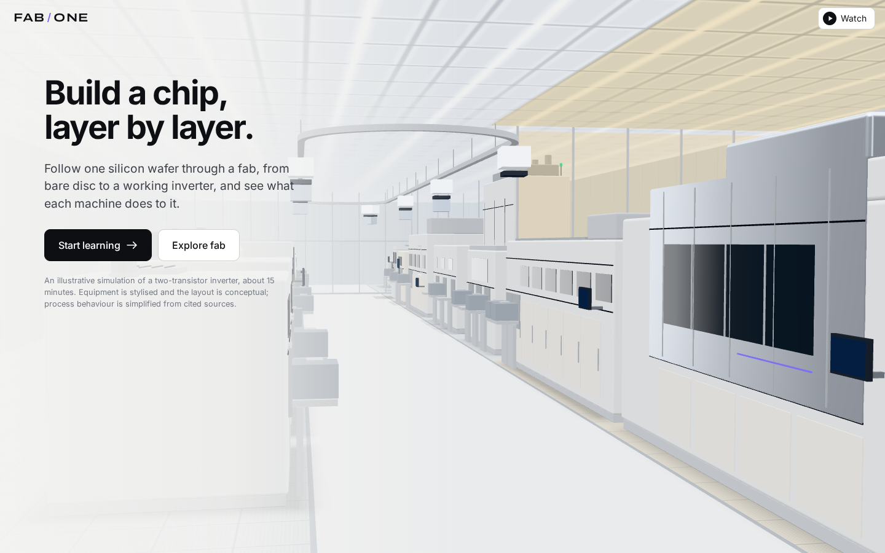
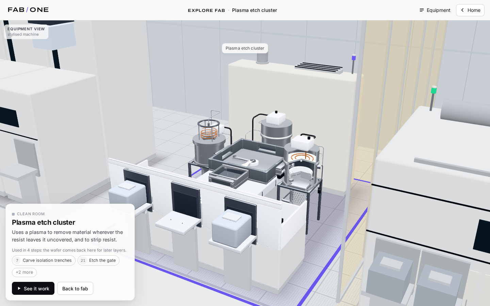
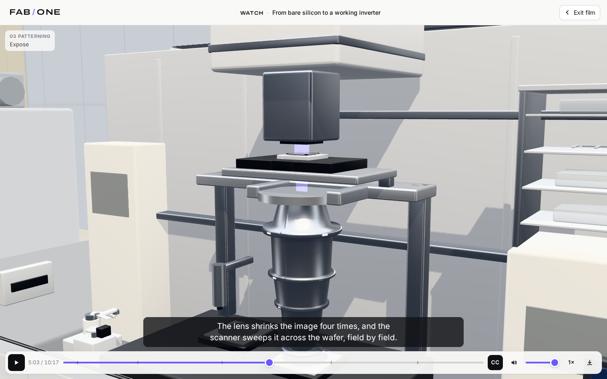

# FAB / ONE

**Build a chip, layer by layer.** FAB / ONE is an interactive 3D simulation you run in the
browser. It follows one silicon wafer through a simplified CMOS fab until it becomes a
working two-transistor inverter: input low gives output high, input high gives output low.

There are three ways in, all on the same fab and the same process model:

* **Learn** — the guided journey: 37 steps in five chapters (**Wafer → Transistors →
  Pattern → Connect → Test**), 12–18 minutes. Each step changes one deterministic process
  model, and the machines, the wafer, the magnified cross-section, the measurements, the
  wafer map and the final electrical test all read from it. Change the spin speed, exposure
  dose, contact overlay or particle clean and you change the chip you end up testing.
* **Explore fab** — walk the bay, pick any of its 15 machines, read what it does, and watch
  it work in an isolated demonstration. Nothing you do there changes your lesson.
* **Watch** — a narrated film of the whole journey (about 10 minutes), with captions,
  chapters and an offline download.



| Coating (track, cut away) | Develop: the magnified cross-section |
|---|---|
|  |  |
| **Explore fab: the etch cluster** | **Watch** |
|  |  |

Short recordings (rendered frame by frame, see [below](#recordings)):
[machine to machine](docs/recordings/01-arrive-to-transfer.mp4) ·
[machine → wafer → die → layers](docs/recordings/02-develop-machine-to-layers.mp4) ·
[explore and return](docs/recordings/03-explore-and-return.mp4) ·
[the film, with narration](docs/recordings/04-watch-expose-to-develop.mp4) ·
[phone](docs/recordings/05-phone-coat.mp4).
Round one's screenshots are kept in [`docs/screenshots/round1/`](docs/screenshots/round1/)
for comparison; what changed is in [`docs/ROUND2.md`](docs/ROUND2.md).

## Run it locally

You need Node.js 20.19+ or 22.12+ (tested with 22.22).

```bash
npm install
npm run dev            # http://127.0.0.1:5173
```

To serve the production build instead (needed for *Save for offline*):

```bash
npm run build
npm run preview        # http://127.0.0.1:4173
```

## Scripts

| command | what it does |
|---|---|
| `npm run dev` | development server with hot reload (port 5173) |
| `npm run build` | type-check (`tsc -b`) and build to `dist/` (also writes `dist/app-files.json`, the checksummed file list used by *Save for offline*) |
| `npm run preview` | serve `dist/` (port 4173) |
| `npm run typecheck` | TypeScript only |
| `npm test` | unit tests (Vitest): process model, captions, film timeline |
| `npm run e2e` | browser tests (Playwright) on desktop, tablet and phone sizes against the production build; builds and starts the preview server itself |
| `npm run screenshots` | regenerate `docs/screenshots/round2/` from the production build |
| `tools/narration/build.sh` | re-render the film's narration from `src/content/narration.json` (offline; see [its README](tools/narration/README.md)) |
| `node scripts/record.mjs scripts/recordings/<name>.json` | render a recording frame by frame (dev server running) |
| `node scripts/stats.mjs` | draw calls, triangles, per-frame CPU cost and JS heap for a set of views (dev server running) |
| `node scripts/cue-alignment.mjs` | decode the narration in the browser and compare where speech starts and ends with the film's cue times |

The browser tests use Playwright's Chromium with software WebGL (SwiftShader), so they
also run on machines without a GPU. If Playwright's browser isn't installed yet, run
`npx playwright install chromium` once.

## Using it

### Learn

* **Start learning** (or **Resume learning**) on the home page. The header shows the
  chapter, the step's title and its number; **Chapters** opens a drawer with every step.
* Each step has one sentence, at most one control and **Continue**. A short caption beside
  the animation says what is happening now; "What changes" and "Why it matters" appear in the
  panel as the step plays. **Replay** plays the step again, and the scrubber seeks within it.
* The camera follows each step: the machine, the process, the wafer, your die (outlined in
  violet from the die map on) and, where it matters, the **magnified cross-section**. A
  quiet label says which you are seeing. **Inspect layers** and **Back to equipment** switch
  between the machine and the cross-section at any time; this never changes your run. Drag,
  pinch or scroll to look around; **Guided view** brings the camera back.
* In the cross-section you can switch the cutaway and x-ray (transparent insulators); in
  the scanner, implanter, inspection and metrology tools you can show the light, laser or
  beam path. Invisible radiation is never drawn unless you ask for it.
* **New words** are defined in the step where they first appear; hover, focus or tap any
  dotted term for its definition later on. **Look closer** opens a labelled cross-section,
  a short explanation and one source; **What changed?** compares before and after.
* **Experiments**: skip the particle clean, change spin speed, under- or over-expose, shift
  the contact overlay. Inspection shows what happened, rework lets you try again, and every
  changed setting has a **Restore** button.

### Explore fab

* **Explore fab** (header or home) shows the whole bay. Click or tap a machine, or open the
  **Equipment** list (keyboard and screen-reader friendly). Each machine opens with its name,
  what it does, and every step that uses it (several machines are visited more than once).
* **See it work** plays that machine's most characteristic step as a labelled
  **Demonstration** on a sample wafer. **Open this lesson** is the only way from here into
  the lessons. **Return to lesson** brings you back exactly where you were, paused, with a
  **Resume** button.

### Watch

* **Watch** (top right, on every screen size) starts the film. Controls: play/pause, a seek
  bar with chapter marks, captions, mute and volume, speed (0.75–1.5×), and **Save for
  offline**, which downloads the film and this site (about 6 MB), checks every file, and only
  then says it is available without a connection.

### Keyboard

| where | key | action |
|---|---|---|
| lesson | → / ← | next / previous step |
| lesson | Space | play / pause the step |
| lesson | R | replay the step |
| lesson | I | inspect layers / back to equipment |
| lesson | G | guided view |
| lesson | C | chapters |
| lesson | E | explore fab |
| lesson | L | look closer |
| final test | 0 / 1 | set the input |
| explore | Esc | back to the whole fab, then back where you came from |
| film | Space or K · ← / → · M · C · Esc | play/pause · −/+5 s · mute · captions · exit |
| anywhere | Esc | close a panel |

### Addresses

The URL always says where you are, so Back/Forward, refresh and shared links work:

| address | opens |
|---|---|
| `/` | home |
| `?step=expose` | a lesson (ids are listed in [`IMPLEMENTATION.md`](IMPLEMENTATION.md)) |
| `?explore`, `?explore=etch`, `?explore=etch&demo=1` | the bay, a machine, its demonstration |
| `?watch`, `?watch&t=245` | the film, at a time in seconds |

Review parameters, read once on a lesson link: `p` (freeze at a progress 0–1), `view=device`
(start in the cross-section), `clean`, `spin`, `dose`, `overlay` (experiment choices),
`lp`, `xray`, `in` (light path, x-ray, final-test input), `panel` (`closer`, `compare`,
`chapters`, `legend`, `recap`, `euv`), `motion=reduce`, `fast=1` (six times faster), `flat=1`
(the 2D fallback). Test harness: `virt=1` (frame-stepped rendering) and `hooks=1`.

Progress, choices and answers are saved in `localStorage` (`fab-one:v2`; round-one saves are
migrated), so a reload resumes where you left off.

## Browsers and devices

The app uses WebGL 2 through three.js. It was tested in Chromium (Playwright's build, with
software rendering) at desktop, tablet and phone sizes, portrait and landscape; Firefox and
Safari were not available to test. On phones the lesson stacks: the 3D view, then the
caption strip, then the step. Touch works for orbit, pinch-zoom, tapping machines and all
controls. Without WebGL the lesson shows a 2D cross-section of the same simulated die, the
explorer its list, and the film its narration and captions. `prefers-reduced-motion` is
respected: the camera never travels (it holds still compositions and cross-fades between
them), while lessons and the film keep their timing, captions and narration.

## Recordings

The recordings in `docs/recordings/` were rendered frame by frame with the app's virtual
clock (`?virt=1`: each frame advances time by exactly 1/30 s), because the build machine
only has software WebGL and cannot render in real time. They show exactly what the app
draws, at the intended speed; the film excerpt carries the narration from the same MP3
files the app plays, placed on the same timeline. The specs are in `scripts/recordings/`.

## Project layout

```
src/
  sim/        deterministic process model (no React/Three): grid, ops, flow, replay,
              optics, metrology, electrical test, diagnosis, wafer map (+ worker)
  content/    learner-facing copy: steps, captions (beats), shot tracks, machines,
              the film script (narration.json, film.ts), glossary, sources
  state/      stores (mode, learning run, clock), navigation, persistence, presentations
  three/      the stage (director, tracks, flights, anchors), the bay, tool scenes,
              device mesher, wafer, labels
  watch/      film timeline, player (the narration clock), offline package
  ui/         header, home, lesson panel and HUD, explorer, film controls, overlays
public/       narration audio and manifest, service worker
tools/        narration pipeline (Kokoro, offline)
scripts/      capture, sequence, record, stats
e2e/          Playwright tests
docs/         round-two notes, plan, scene guide, screenshots, recordings, audio auditions
```

## Documentation

* [`docs/ROUND2.md`](docs/ROUND2.md): what changed in round two, how it was verified, and
  what is still not right.
* [`IMPLEMENTATION.md`](IMPLEMENTATION.md): state model, modes and navigation, the stage and
  its camera, the film, replay and seek, and the step → scene → operation mapping.
* [`ACCURACY.md`](ACCURACY.md): what is physically right (with sources), what is
  approximated, and what is not modelled.
* [`tools/narration/README.md`](tools/narration/README.md): how the narration is made, with
  model provenance, pinned versions, hashes and licences.

## Known limitations

This is a teaching model, not a process simulator. The device is drawn in schematic grid
units with vertical exaggeration. The optics use a Gaussian blur, not a diffraction-limited
imaging model. The electrical test uses connectivity plus simple gate-length rules, not
device physics. The equipment is stylised and procedural, the fab layout is conceptual, and
the yield number is a toy. The narration voice was chosen by automatic measurements; nobody
has listened to it yet. [`ACCURACY.md`](ACCURACY.md) and [`docs/ROUND2.md`](docs/ROUND2.md)
list each approximation and what is left out.
