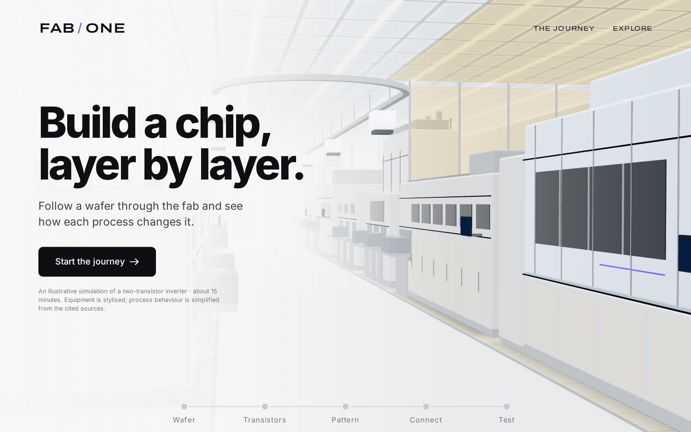
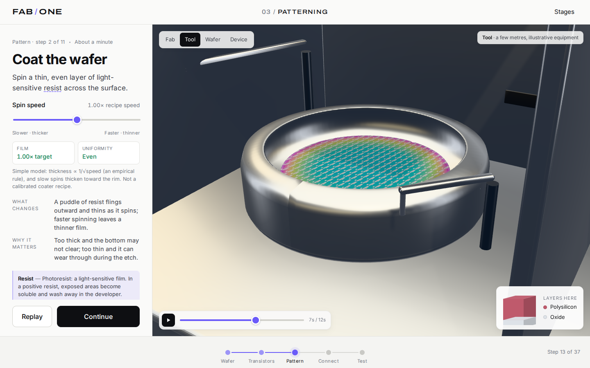
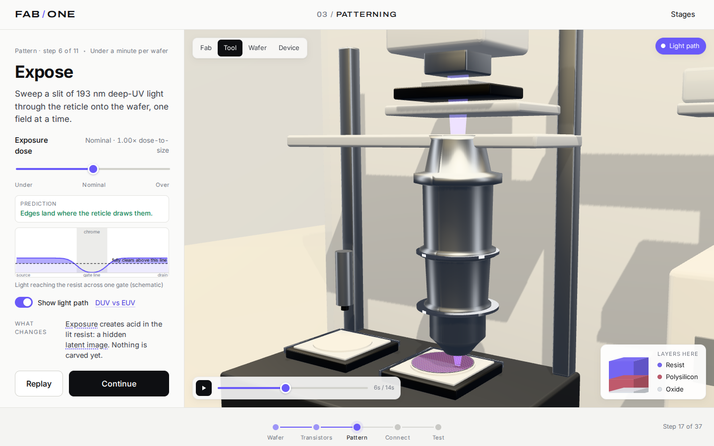
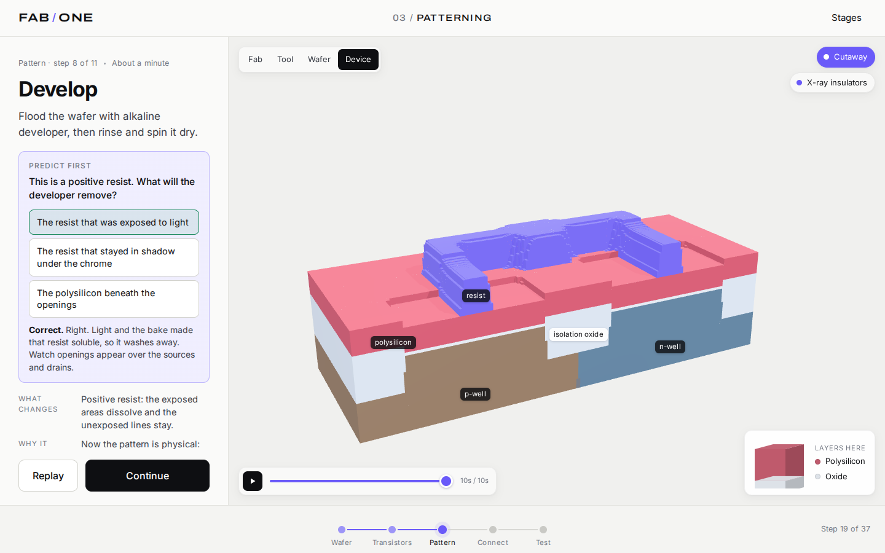
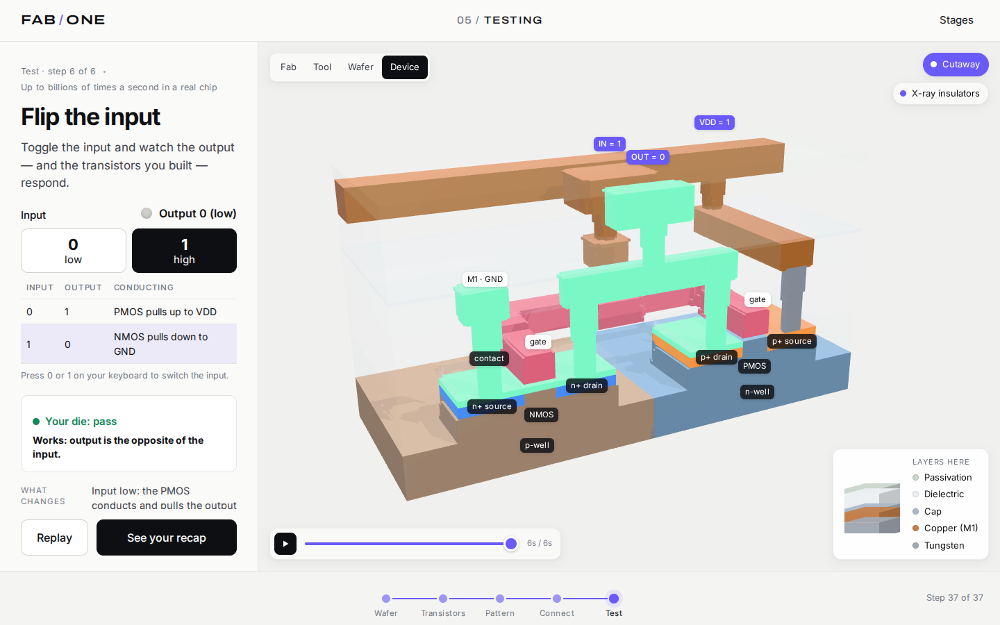

# FAB / ONE

**Build a chip, layer by layer.** FAB / ONE is an interactive 3D simulation you run in the
browser. It follows one silicon wafer through a simplified CMOS fab until it becomes a
working two-transistor inverter: input low gives output high, input high gives output low.

The guided journey takes 12–18 minutes and has five chapters: **Wafer → Transistors →
Pattern → Connect → Test**. Most of the time goes to photolithography: coat, bake, align,
expose, develop, inspect, etch. Every step changes one deterministic process model, and the
3D cutaway, wafer view, measurements, wafer map and final electrical test all read from that
model. If you change the spin speed, exposure dose, contact overlay or particle clean, you
change the chip you end up testing.



| Coating | Exposure (light path on) |
|---|---|
|  |  |
| **Develop: cross-section** | **Final test** |
|  |  |

## Run it locally

You need Node.js 20.19+ or 22.12+ (tested with 22.22).

```bash
npm install
npm run dev
```

Then open **http://127.0.0.1:5173**.

To serve the production build instead:

```bash
npm run build
npm run preview        # http://127.0.0.1:4173
```

## Scripts

| command | what it does |
|---|---|
| `npm run dev` | development server with hot reload (port 5173) |
| `npm run build` | type-check (`tsc -b`) and build to `dist/` |
| `npm run preview` | serve `dist/` (port 4173) |
| `npm run typecheck` | TypeScript only |
| `npm test` | unit tests for the process model (Vitest) |
| `npm run e2e` | browser tests (Playwright) on desktop, tablet and phone sizes against the production build; builds and starts the preview server itself |
| `npm run screenshots` | regenerate `docs/screenshots/` |

The browser tests use Playwright's Chromium with software WebGL (SwiftShader), so they
also run on machines without a GPU. If Playwright's browser isn't installed yet, run
`npx playwright install chromium` once.

## Using it

* **Start the journey** on the home page, or **Explore** to jump to any stage.
* Each step has one sentence, at most one control and **Continue**. "What changes" and
  "Why it matters" appear as the animation plays. **Replay** plays the step again, and the
  scrubber seeks within it.
* **Zoom levels**: Fab · Tool · Wafer · Device. In the device view you can switch the
  cutaway and x-ray (transparent insulators) on and off. At the scanner you can show the
  light path.
* **Look closer** opens a labelled cross-section, a short explanation and one source.
  **What changed?** compares the step's before and after. **Legend** explains the colours.
* **Experiments**: skip the particle clean, change spin speed, under- or over-expose,
  shift the contact overlay. Inspection shows what happened, rework lets you try again, and
  every changed setting has a **Restore** button.

### Keyboard

| key | action |
|---|---|
| → / ← | next / previous step |
| Space | play / pause the step animation |
| R | replay the step |
| 1 2 3 4 | zoom level: fab, tool, wafer, device |
| S | stages overview |
| L | look closer |
| 0 / 1 | set the input on the final test |
| Esc | close a panel |

### Deep links

Every step has a URL, and a few parameters help with review and testing:

| parameter | example | effect |
|---|---|---|
| `step` | `?step=expose` | open a step (ids are listed in [`IMPLEMENTATION.md`](IMPLEMENTATION.md)) |
| `view` | `&view=device` | start at a zoom level (`fab`, `tool`, `wafer`, `device`) |
| `p` | `&p=0.5` | freeze the step animation at a progress between 0 and 1 |
| `clean`, `spin`, `dose`, `overlay` | `&dose=0&overlay=5` | set the experiment choices (`clean=0`, `spin` 0–1, `dose` 0–4, `overlay` −7…7) |
| `motion` | `&motion=reduce` | force reduced motion |
| `fast` | `&fast=1` | play step animations six times faster |
| `lp`, `xray`, `in` | `&lp=1` | light path on, x-ray on, final-test input = 1 |
| `panel` | `&panel=euv` | open a panel: `closer`, `compare`, `stages`, `legend`, `recap`, `euv` |
| `flat` | `&flat=1` | force the 2D fallback used when WebGL is unavailable |

Progress, choices and answers are saved in `localStorage` (`fab-one:v1`), so a reload
resumes where you left off.

## Browsers and devices

The app uses standard WebGL 2 through three.js. It was tested in Chromium at desktop
(1440 × 900), tablet (1024 × 768) and phone (390 × 844) sizes; current Firefox and Safari
should work but were not tested. On phones the layout stacks: the 3D view sits above the
step, and the step's control comes right after its one-sentence instruction. Touch works for orbit, pinch-zoom and all controls. If WebGL
is unavailable, the viewport falls back to a 2D cross-section of the same simulated die,
and every step, control and result still works. `prefers-reduced-motion` is respected.

## Project layout

```
src/
  sim/        deterministic process model (no React/Three): grid, ops, flow, replay,
              optics, metrology, electrical test, diagnosis, wafer map (+ worker)
  content/    learner-facing copy: steps, glossary, sources
  state/      zustand stores (journey, choices, clock) and model hooks
  three/      React Three Fiber scenes: stage/camera, device mesher, wafer, tools, labels
  ui/         step panel, controls, overlays, home, chrome
e2e/          Playwright tests and the screenshot script
docs/         plan, scene guide, screenshots
```

## Documentation

* [`IMPLEMENTATION.md`](IMPLEMENTATION.md): state model, replay and seek, how the views read
  the state, and the step → scene → operation mapping.
* [`ACCURACY.md`](ACCURACY.md): what is physically right (with sources), what is
  approximated, and what is not modelled.
* [`docs/PLAN.md`](docs/PLAN.md): the short plan written before building.

## Known limitations

This is a teaching model, not a process simulator. The device is drawn in schematic
grid units with vertical exaggeration. The optics use a Gaussian blur, not a
diffraction-limited imaging model. The electrical test uses connectivity plus simple
gate-length rules, not device physics. The equipment is stylised, and the yield number is a
toy. [`ACCURACY.md`](ACCURACY.md) lists each approximation and what is left out.
