# FAB / ONE — round two

What changed in round two, how it was checked, and what is still not right. The design
notes for the new pieces are in [`IMPLEMENTATION.md`](../IMPLEMENTATION.md) (sections marked
*round two*); accuracy notes for the film are in [`ACCURACY.md`](../ACCURACY.md).

## Changes

### One fab, one wafer, one camera

* **A single persistent 3D stage** replaces the per-view canvases. The bay is one world in
  metres; every machine stands at its station. The machines the story needs are mounted as
  their detailed models at the same place and orientation, and a **director** owns the
  camera in every mode.
* **Housings and cutaways.** A machine's bay model is its housing. When the story arrives
  at a machine, the upper front of the housing wipes away (clipping planes, 0.8 s) and the
  detailed interior is revealed inside it: the same silhouette, load ports and orientation
  from the overview to the close-up. Machines the story is not at stay closed.
* **Continuous transitions.** Between lessons the camera steps back into the aisle, travels
  along it (through the doorway to the back-end room), holds briefly on the whole new
  machine, then moves in. Within a lesson it follows a shot track (content/shots.ts) that
  is a pure function of the step's progress: establish the machine → the process → the
  wafer → your die → the magnified cross-section. The cross-section is a separate scene
  that is cross-faded in, anchored on your die and matched to the camera's direction, so
  the magnified cell appears where, and oriented as, the die was. A retrace plays the same
  path backwards. New moves retarget from wherever the camera is; stale moves never finish.
* **Steps that span several tools are directed by hand.** In sti-etch, wells, contact-fill and
  metal1 the lithography, deposition or etch before the machine's own action happens in
  other tools, so the camera stays with the layers, comes out to the machine when the wafer
  arrives, and goes back down through the wafer to show what changed. The furnace, the
  hot-plate lid and the ash plasma enclose the wafer, so anneal, peb and strip go down to
  the layers before they close. Moves into the cross-section anchor on your die when the
  machine is showing the wafer and on the machine when it is not.
* **Your die is outlined** on the wafer from the die-map step onwards, wherever the wafer goes.

### Three modes, one model

* **Learn** (the lessons), **Explore fab** and **Watch** share the scenes, the process model
  and the step definitions. The URL is the source of truth (`?step=…`, `?explore[=machine]`,
  `?watch[&t=…]`); Back/Forward, refresh and deep links all go through one parser.
* **Explore** pauses and snapshots the lesson (step, progress, overlays, camera). Returning
  restores it exactly and offers *Resume* instead of playing by surprise. Demonstrations
  run on the canonical run in an isolated preview labelled *Demonstration* and never touch
  the learner's wafer or progress; *Open this lesson* is the only way into a lesson.
* **Watch** plays a narrated film of the canonical successful run (about 10 minutes), with
  its own clock and no quizzes; the learning run is never read or written.
* Saved progress moved to a validated v2 format; v1 saves are migrated.

### Interface

* **Home**: the fab full-bleed with a compact introduction laid out in normal flow below a
  header that owns its own row, so the wordmark and headline cannot collide at any size,
  zoom or font state. Actions: *Start learning* / *Resume learning*, *Explore fab*; *Watch*
  with a play icon at the top right (also on phones).
* **Header**: chapter, step title and step count; *Chapters*, *Explore fab*, *Watch*. The
  Fab/Tool/Wafer/Device switch is gone: a quiet scale label says what the picture shows
  (Equipment view, Wafer surface, Magnified cross-section) and two contextual commands move
  between scales (*Inspect layers*, *Back to equipment*; *Guided view* after looking around).
* **Chapters**: one light drawer with every chapter and step; visited steps and answered
  checks are marked differently; skipped checks are never marked done.
* **Captions**: one short sentence (12–24 words, one idea) beside the animation, timed to the
  process (content/beats.ts), never duplicating the step panel; on phones a stable strip
  below the canvas. A few restrained labels are anchored to the wafer.

### Accessibility

* **Reduced motion** keeps the whole lesson: the camera never travels (still compositions
  and 0.35 s cross-fades, no housing wipe, a still home view), while steps and the film play
  in time so the captions, narration and process keep their pacing. Round one landed each
  lesson on its result, which skipped the captions in between.
* Every machine can be chosen from the **Equipment** list (keyboard, screen reader, touch);
  focusing an entry outlines the machine in the bay. Without WebGL the lesson falls back to
  the 2D cross-section, the explorer to its list and cards, the film to captions and audio.
* New keyboard shortcuts: I (inspect layers / back to equipment), G (guided view), C
  (chapters, replacing round one's S for stages), E (explore fab); in the film Space/K, ←/→,
  M, C and Esc.

### Narration and the film

* Offline text-to-speech with **Kokoro-82M v1.0** (Apache-2.0, obtained through the npm
  package `expo-kokoro@1.1.9` because huggingface.co is not reachable from the build
  environment), voice **bm_george** at speed 1.0, British G2P with a pronunciation
  dictionary. 91 cues, 39 segments, 8 min 21 s of speech, 3.9 MB of 64 kbps mono MP3.
  Pipeline, pinned versions, hashes, licences and QA: [`tools/narration/`](../tools/narration/README.md).
* Voice auditions (bm_george, bm_fable, bm_lewis, bm_daniel, and two slower takes) with
  automatic QA are in [`docs/audio/auditions/`](audio/auditions/report.md). **Nobody has
  listened to them yet** — the choice of bm_george rests on measurements only.
* One timeline: the narration audio is the clock while it plays; the silent camera moves
  between segments run on the page clock. Pause, seek, speed, mute, buffering and chapter
  jumps all act on that one time value, and every frame is a pure function of it.
* **Save for offline**: an explicit download of this build and the film, verified file by
  file (sha256), committed only when complete, served by a service worker when the network
  fails. Nothing is claimed as available offline before that.

## Before and after

Round one's screenshots were taken from the round-one branch before any change
([`screenshots/round1/`](screenshots/round1/)); round two's with `npm run screenshots`
([`screenshots/round2/`](screenshots/round2/)), at the same sizes and addresses.

| | Round one | Round two |
|---|---|---|
| Home, 1440 × 560 (the reported overlap) | 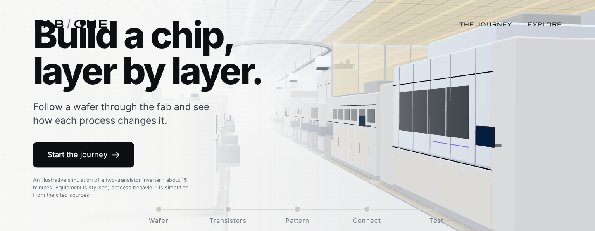 | 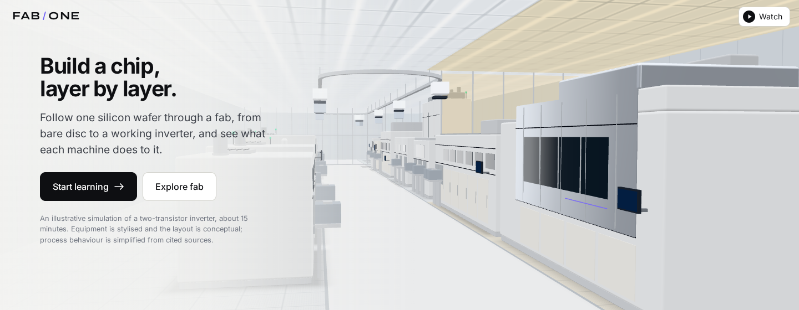 |
| Home, 1920 × 640 | 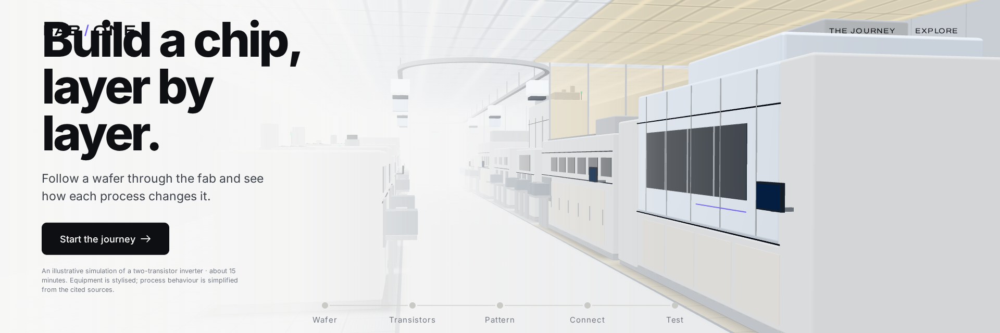 | 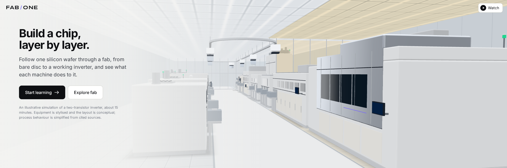 |
| Home, phone | 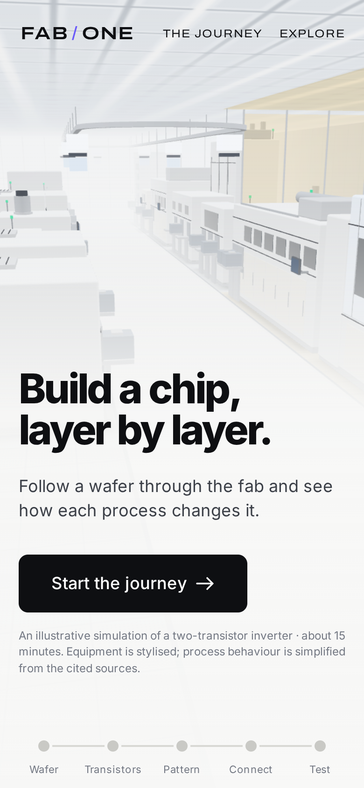 | 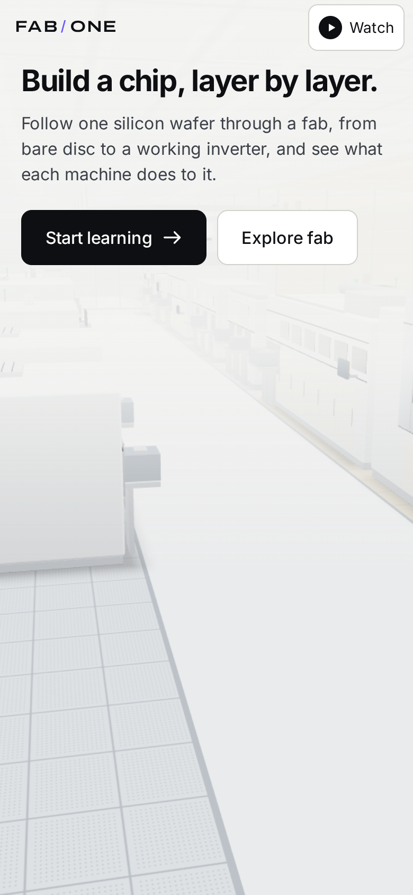 |
| Home, phone landscape | 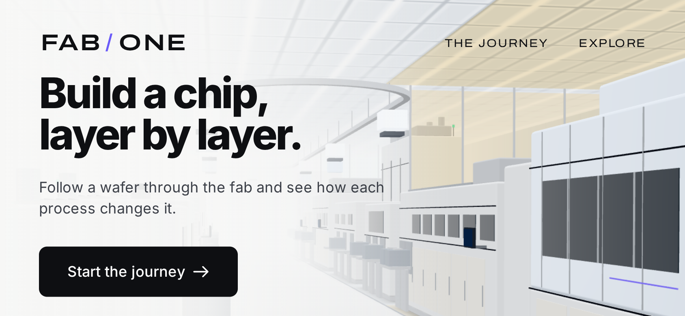 | 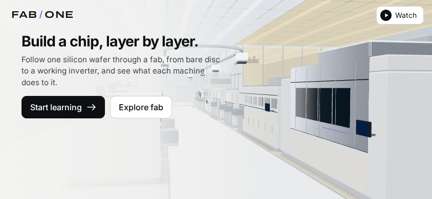 |
| Coating | 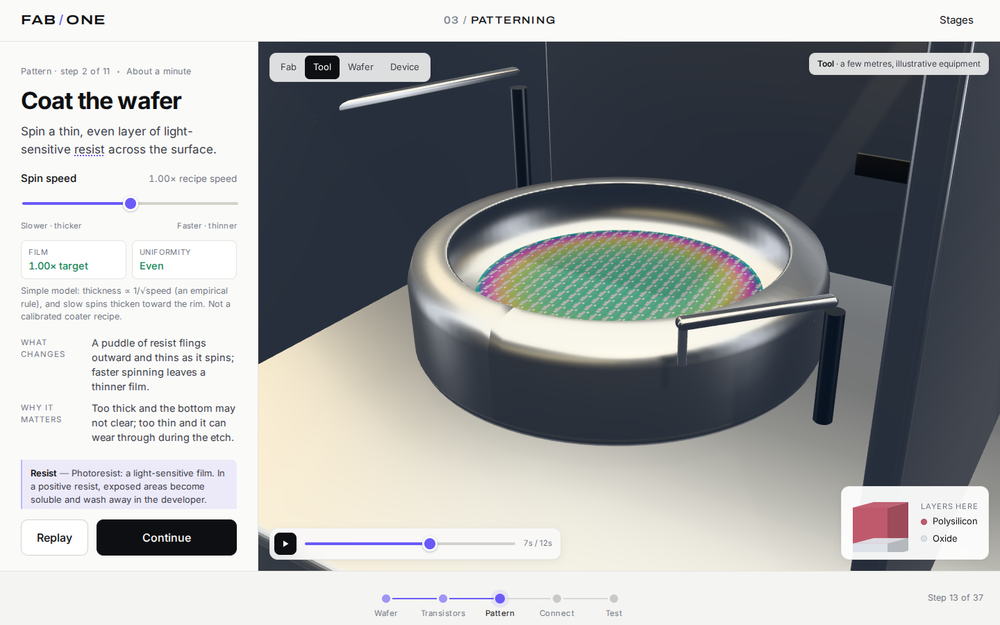 | 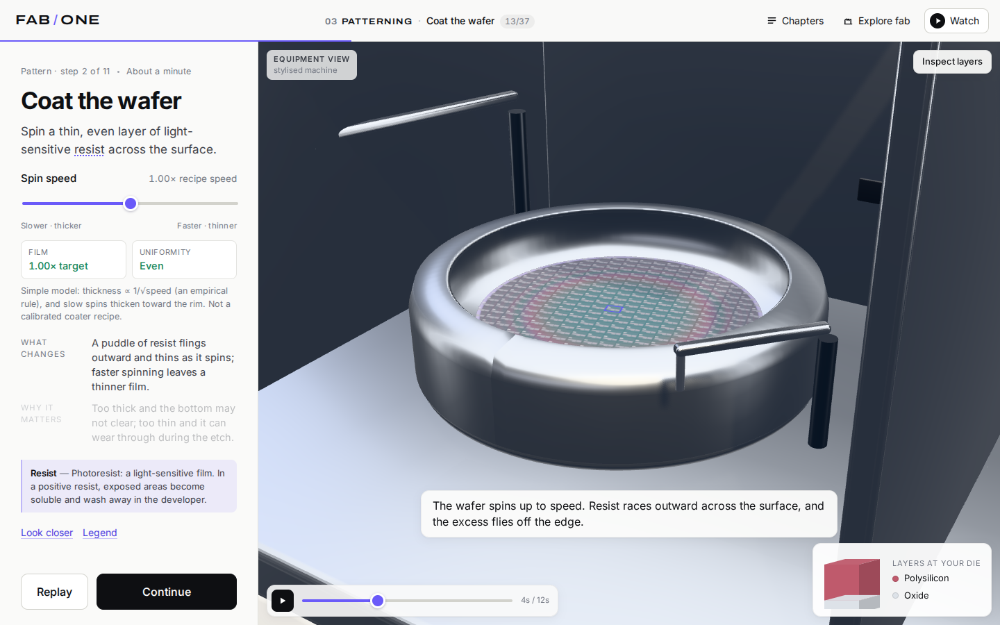 |
| Coating, phone | 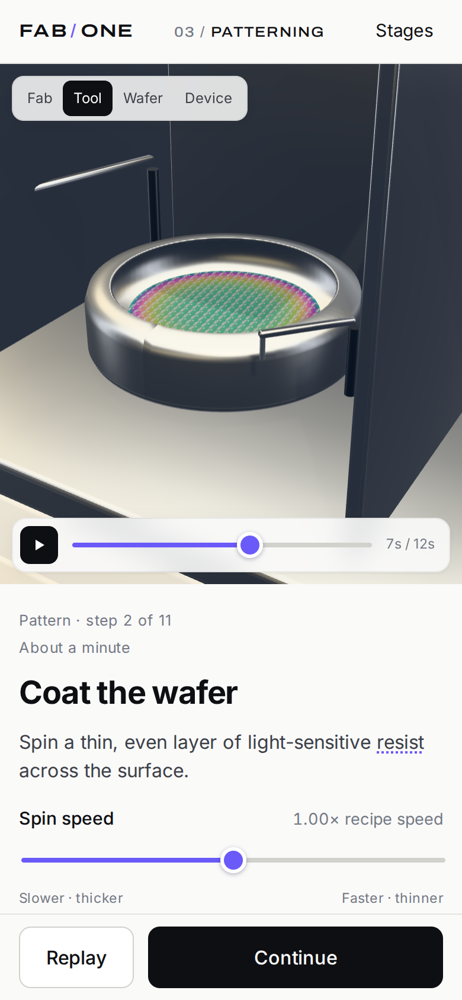 | 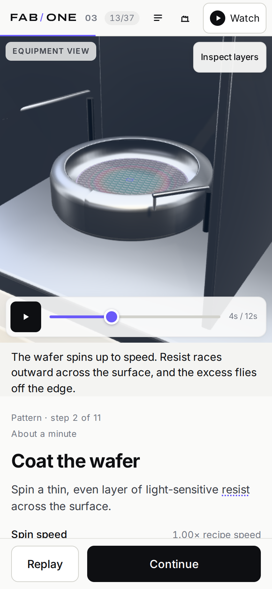 |
| Develop, cross-section | 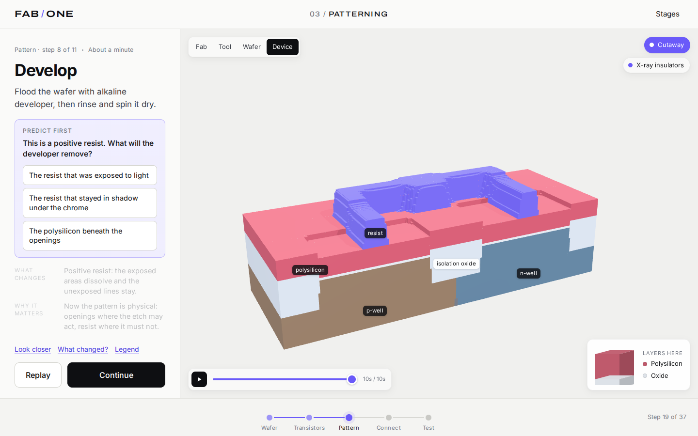 | 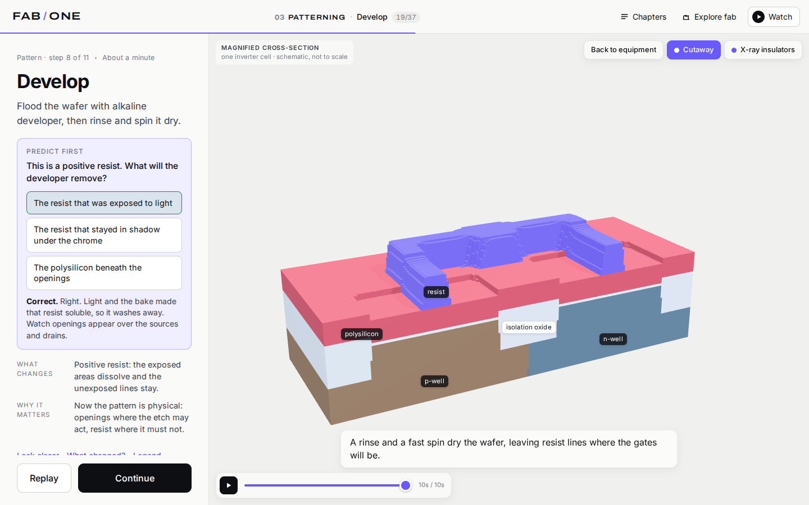 |

New in round two: [the fab explorer](screenshots/round2/explore-overview-1440x900.png),
[a machine card](screenshots/round2/explore-etch-1440x900.png),
[a demonstration](screenshots/round2/explore-scanner-demo-1440x900.png),
[the explorer on a phone](screenshots/round2/explore-phone.png),
[the chapters drawer](screenshots/round2/learn-chapters-1440x900.png),
[the film](screenshots/round2/watch-expose-1440x900.png) and
[on a phone](screenshots/round2/watch-phone.png).

Stills cannot show continuity or sync, so there are also short recordings, rendered frame by
frame on the app's virtual clock (the build machine has no GPU; see the README):

* [Machine to machine](recordings/01-arrive-to-transfer.mp4): arrival at the load port,
  then the move to the next step's machine.
* [Machine → wafer → die → layers](recordings/02-develop-machine-to-layers.mp4): the
  developer, down to the wafer, your die, and the anchored cross-fade into the
  cross-section as the exposed resist clears.
* [Explore and return](recordings/03-explore-and-return.mp4): a paused lesson, the whole
  fab, the etch cluster, its demonstration, and back to the lesson exactly where it was.
* [The film, with narration](recordings/04-watch-expose-to-develop.mp4): exposure to
  development, with the narration from the same MP3s placed on the same timeline.
* [Phone](recordings/05-phone-coat.mp4): coating on a phone, with the caption strip.

## Verification

Everything below was run on the build machine: a 4-core Linux container with no GPU, using
Playwright's Chromium (headless shell 1194) with software WebGL (SwiftShader). Firefox and
WebKit were not available. Phone and tablet runs are emulated (viewport, touch, pixel ratio).

### Commands and results

| command | result |
|---|---|
| `npm run typecheck` | clean |
| `npm test` | 30 tests in 3 files pass (process model 22, captions 3, film timeline 5) |
| `npm run build` | builds; see *Sizes* below |
| `npm run e2e` | E2E_RESULT |
| `node scripts/cue-alignment.mjs` | speech starts 40–60 ms after each of the 91 cue times (captions lead the voice slightly); cue ends include 100–150 ms of trailing silence; decoded lengths match the manifest exactly |
| `node scripts/stats.mjs` | see *Performance* below |

### Sync

* **Clock against narration.** `e2e/watch.spec.ts` samples, every 100 ms, the time the
  picture is drawn at (`FilmPlayer.now()`) against the playing audio element's own
  position. Worst difference: 0.0 ms over 40 samples during normal playback, and 0.0 ms over
  20 samples after two seconds in the background (animation frames withheld,
  `document.hidden` true). This is zero by construction: the picture reads the audio
  element's position whenever it draws, rather than counting frames, so it cannot drift.
  The same test checks pause (time holds), seek, 1.5× speed and mute (time still runs from
  the muted audio), a chapter jump, and the 150 ms bound.
* **Cues against the audio.** The captions and every semantic event (the camera's and the
  process's cue points) are placed at the manifest's cue times, which the narration pipeline
  measured from the synthesised audio. Decoding the MP3s in the browser and finding speech
  by energy puts speech onset 40–60 ms after each cue start (all 91 cues).
* **Buffering and failure.** With the network throttled, seeking into an unloaded segment
  holds the picture until the narration can play, then carries on; with the MP3s blocked, the
  film says so and plays on the page clock with captions.
* **Not measured:** the output latency of real audio hardware and displays, and anything
  that depends on real frame rates. Software rendering here manages a few frames a second,
  so the picture updates in steps even though each step is drawn at the right time.

### Performance

PERF_TABLE

### Sizes

From `npm run build` (gzip as served by a typical static host):

| part | size | loaded |
|---|---|---|
| app shell: HTML, main script, styles | 477 KB (148 KB gzip) | first visit |
| 3D stage: director, bay, three.js, React Three Fiber | 1.07 MB (289 KB gzip) | right after the first paint |
| machine scenes: 15 tools, wafer, shared parts | 236 KB (80 KB gzip), 3–30 KB each | when a machine is first needed (the next one is preloaded) |
| web fonts (Inter, Archivo; woff2 subsets) | 419 KB in all, 135 KB for Latin | by the browser, per character range |
| film narration: 39 MP3 segments, 64 kbps mono | 4.0 MB | one segment ahead while watching |
| *Save for offline*: all 37 app files and the narration | 6.4 MB | only when asked |

## Known limitations

Candidly, in rough order of how much they matter:

* **Nobody has listened to the narration.** No reliable way to judge audio was available
  while building this. The voice (bm_george) was chosen by automatic measurements: speaking
  rate, pauses, pitch stability, loudness, clipping, and a speech recogniser's word error
  rate against the script (3 %). Every generated clip needs a human listen for wrong
  emphasis, odd pauses and mispronunciations before this is called finished. The auditions
  are in [`docs/audio/auditions/`](audio/auditions/report.md) for exactly that. The Qwen3-TTS
  VoiceDesign candidate was not auditioned: huggingface.co is blocked here and there is no
  GPU.
* **The model came from a mirror.** Kokoro-82M v1.0 was taken from the npm package
  `expo-kokoro@1.1.9`, a quantized ONNX export, because huggingface.co was not reachable. The
  tarball was checked against the npm registry's signed integrity value, but it is a
  third-party packaging of the official weights, not the official files.
* **Only Chromium was tested.** Playwright's Chromium ran with software WebGL (SwiftShader)
  on a 4-core machine without a GPU. Firefox and WebKit were not installed. The phone and
  tablet runs are emulation (viewport, touch and pixel ratio); no real device was tested.
* **Frame rate is unverified.** The 60 fps (desktop) and 30 fps (mid-range phone) targets
  could not be measured: software rendering manages a few frames a second here, so the
  numbers above are per-frame CPU cost, draw calls and triangles, not frame rate. The
  recordings were rendered frame by frame on the virtual clock for the same reason: they
  show exactly what the app draws and when, not that it draws it in real time.
* **Sync is measured at the clock, not at the speaker.** The picture reads the narration's
  position when it draws, and the cue times match the decoded audio to within 60 ms. What
  could not be measured is the output latency of real audio hardware and displays, and on
  software rendering frames arrive a few times a second, so the picture moves in steps.
* **Equipment is still procedural and stylised.** No Blender or glTF assets were made
  (Blender is not available here) and no stock models were used. Housings are simplified
  enclosures. Interiors are reference-informed but schematic; nothing is an OEM's actual
  design.
* **Camera direction is partly generated.** Nine steps have hand-directed tracks (the
  multi-tool and enclosed ones); the rest use the default grammar (machine → wafer → die →
  cross-section, hold, retrace) built from their scene and view. Some framings are tighter
  or looser than a person would choose, and the close-up of your die is plain where the
  wafer's surface has little pattern.
* **The film is one fixed cut.** It covers the canonical successful run only; experiments
  and failures are Learn-only. Captions and narration are in English only.
* **Offline is for this build, in browsers with service workers.** The download checks
  storage first and verifies every file, but it was tested in Chromium only; Safari's
  storage eviction rules were not tested.
* Everything in round one's limitations still applies: the device is schematic grid units
  with vertical exaggeration, optics use a Gaussian blur rather than an imaging model, the
  electrical test uses connectivity and simple rules rather than device physics, and the
  fab layout is conceptual.
